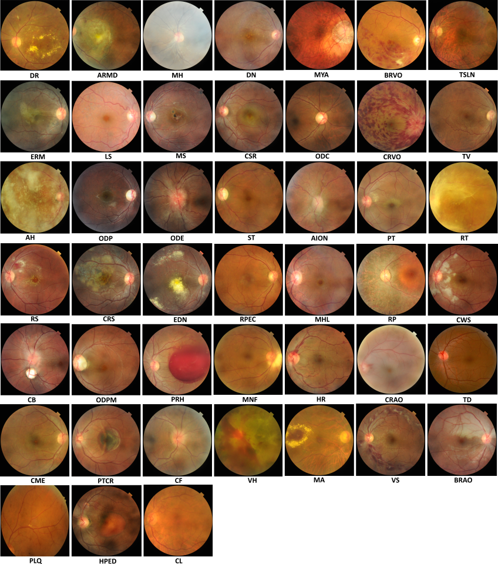
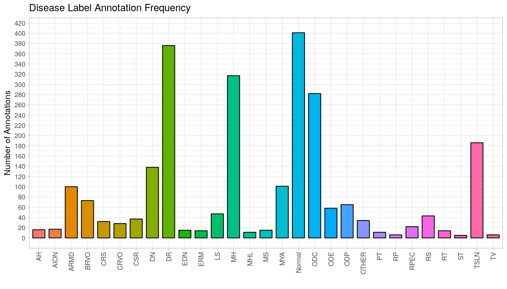

# Multi-Disease Detection in Retinal Imaging using Modified EfficientNetB4 

Participation at the Retinal Image Analysis for multi-Disease Detection Challenge (RIADD):

Link: https://riadd.grand-challenge.org/

# Reproducibility

## Requirements:

- Ubuntu 18.04
- Python 3.7
- Tensorflow 2.2.0
- NVIDIA P100 GPU or a GPU with equivalent performance 

## Sample Images from Dataset

## Classwise distribution of diseases

## Author

- [@sandesh001](https://github.com/sandesh001)

